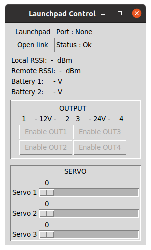
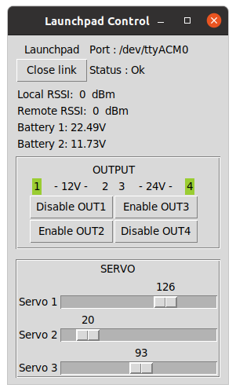

# Ground Station <!-- omit in toc -->

The software on this repository is used to control and monitor the Launchpad for the Mjollnir project.

The code here is based on the code used for the Sigmundr project (2019) that was released as [v1.0](https://github.com/aesirkth/ground-control/tree/v1.0). v1.0 included a Dashboard to display the live Telemetry from the rocket. The codebase for this Dashboard is still present in this repository and will remain until the decision is made to use a new Dashboard technlogy

# Table of contents <!-- omit in toc -->
- [Requirements](#requirements)
- [How to install ?](#how-to-install-)
- [Use](#use)
- [Folder structure](#folder-structure)





# Requirements

- A laptop running Windows or Linux (not tested on MacOS)
- A complete Launchpad Controller board (see [aesirkth/launchpad-controller](https://github.com/aesirkth/launchpad-controller))


# How to install ?

**Install the GUI requirements**

Install `python 3.7.4`

> Earlier versions of python could work as well but have not been tested

Install the required python packages

```sh
python -m pip install -r requirements.txt
```


# Use

Get the *Launchpad Controller* up and running (see [aesirkth/launchpad-controller](https://github.com/aesirkth/launchpad-controller))


**Run the GUI**

Make sure the *Launch Pad Station Board* is connected to your computer

Run `lps_control.py`

```
python ./launchpad_control.py
```

Enjoy


# Folder structure

``` py
.
├── README.md                   # This file
├── data/                       # Folder to store the received telemetry
├── doc/                        # The documentation goes there
├── gui/
│   └── widgets.py              # Widgets used in the GUIs
├── utils/
│   ├── gateway.py              # Class used to process data from the Gateways
│   ├── sensors.py              # Class used to process data from the sensors
│   └── serialwrapper.py        # Class used to read/write data from serial link
├── dashboard.py                # Dashboard
├── launchpad_control.py        # GUI to control the Launchpad Controller
├── radio_test.py               # Small utility to test the telemetry radio link
└── requirements.txt
```