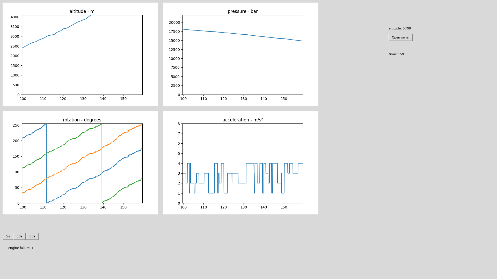

## dummy modem
It uses the same teensy lc as https://github.com/klownfish/aesir-grafana-dashboard

## dependencies
Install the python dependencies\
`python -m pip install -r requirements.txt`

Tkinter is included with Python since Python 3.1

## file structure
```
main.py - spawns the GUI and the thread that handles serial
utils/
├─ widgets.py - GUI widgets
├─ serial_wrapper.py - wrapper around pyserial
├─ data_functions.py - functions and datatypes to handle the raw serial data
├─ data_functionsp.py - W.I.P implementaion of the real protocol
├─ telemetry_data/ - backups of the raw serial communication
```

Basically, `main.py` spawns the Serial thread. The thread creates a 
SerialWrapper that it uses to communicate. The serial thread looks for a frame separator
and when it finds one it uses the ID byte to look up a function that can 
decode the following bytes. All decoding functions are stored in the `data_functions`
dictionary under their corresponding IDs. All data functions return a Data object 
that contains the properties `source`, `measurement` and `value`.

The `Data.value` is then appended into a `TimeSeries` under `database[source][measurement]`.
`database` is a shared dictionary between the serial thread and the main thread.
It is also used as a "global" variable that is used to communicate between different 
parts of the system. All those values are put under `database["misc"]`. See `main.py`
for examples.

The timestamps that are used come from the flight controller's micro seconds since
boot interpolated with help from the computers clock. I am assuming that the clock on the engine 
and flight controller will not drift too much but since the syncing is only based 
on the flight controller it could become a problem when displaying graphs with data from
the engine.

things to do:
* Make serial wrapper init communication with a RFD modem and the launchpad gateway.
* Implement gateway transmission protocol

* Work on the UI
    * Figure out a better way to represent widgets,\
    * Start grouping widgets together in a frame so you don't have to place everything manually\
    * implement the map thing from the old dashboard\
    * A actual map that shows the rocket position would be cool\
    * create two windows, for engine and flight controller\
