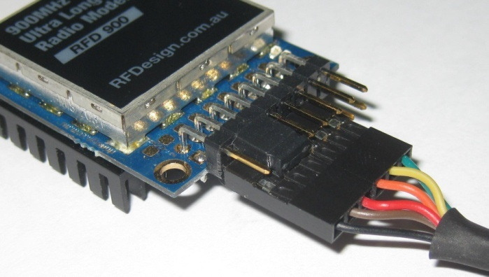

# RFD900

The `RFD900` is a long range radio modem. It works as a transparent serial link. All data that is sent to a modem via `UART` is transmitted to the other modem via RF. A `FTDI` cable can be used to easily connect it to a computer

We use the `RFD900+` version at 868 MHz (`RFD868+`)

[RFD900_Datasheet.pdf](http://files.rfdesign.com.au/Files/documents/RFD900%20DataSheet.pdf)

[Software_Manual.pdf](http://files.rfdesign.com.au/Files/documents/Software%20manual.pdf).

## Wiring

- Connect two 900 MHz half wavelenght dipole antennas to the antenna ports. Make a 90° angle between them

- Connect the `FTDI` cable to the `RFD900` modem. The black wire should be connected to pin `1`. Connect a jumper between pin `4` and pin `6`. See image below

- Connect the `FTDI` cable to the `USB` port of the computer
  

`FTDI` connection cable

## Settings

Tools for the `RFD900` modems are found here: [files.rfdesign.com.au/tools](https://files.rfdesign.com.au/tools/)

Use [RFDTools-V2.33](https://files.rfdesign.com.au/Files/tools/RFDTools-V2.33.zip) (Windows) to change the settings of the `RFD900` modems. Run it as an administrator if you get errors in the "RSSI" tab

Upload the same firmware on all modems. Use the latest version of RFD900+ RFD SiK [RFDSiK V1.13 rfd900p.ihx](https://files.rfdesign.com.au/Files/firmware/RFDSiK%20V1.13%20rfd900p.ihx)

>Always keep the baudrate at the default value (57600). The modems are quite instable at 115200

Use the following settings on all modems :

| Field     | Value  |
| --------- | ------ |
| Baud      | 57600  |
| Air Speed | 64     |
| Min Freq  | 849000 |
| Max Freq  | 850000 |
| Tx Power  | 20     |
| Net ID    | 25     |

