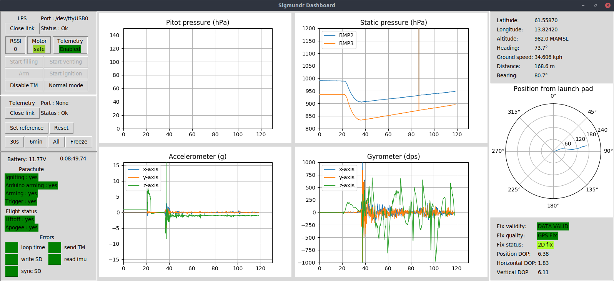

# Dashboard

`dashboard.py`

The dashboard can receive and display in real time the telemetry data sent from the rocket during the flight. The received data is stored on the Ground Station hard drive for future use

The telemetry data is received via radio link by an Arduino board and sent to the computer in real time via serial link. The radio link is unidirectional : it is not possible to send data to the rocket during the flight

The raw telemetry data is processed on the fly on the Ground Station and not on the rocket

The dashboard can also control the Launch Pad Station (see [lps_control](lps_control.md))

First click on "Open Link" in the Telemetry box

The live Telemetry will appear in the dashboard if the rocket is transmitting. Before launch, when the rocket is on the launchpad and transmitting, click on "Set reference" to set the air pressure at the launchpad and the GPS coordinates in the dashboard. Make sure the GPS is receiving correctly before doing so

The time scale can be changed using the row of buttons in the Telemetry box

